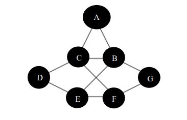

***CS2B – Risk Modelling and Survival Analysis ***


* The emphasis is placed on being able to apply statistical methods to actuarial problems using real data sets and the open-source software environment R. 

* Time Series. Probability Distributions, Survival Analysis, Stochastic Processes

---


***{markovchain} R package***

```{r}

#install.packages("markovchain")

library(markovchain)
```

---

Markov Chain
========================

A particle is moving on the graph below by starting on a randomly chosen vertex (each with
the same probability) and at each time step moving along one of the adjacent edges to a
neighbouring vertex, choosing the edge with equal probability and independently of all
previous movements.


<p align="center">
  
</p>

---

Dgree Sequence
=================

  .pull-left[ ]

.pull-left[  |Vertex  | Degree |
 |------- |--------- |
 |A | 2 |
 |B | 4 |
 |C | 4 |
 |D | 2 |
 |E | 3|
 |F | 3|
 |G | 2|
]

---


Part 1
======================

Create a matrix with the transition matrix with probabilities using the state names as
{A,B,C,D,E,F,G} and plot the transition matrix graph. 
```{r}
 #Create a matrix with the transition probabilities.

Matrix2 <- matrix(c(
  0,1/2,1/2,0,0,0,0,
  1/4,0,1/4,0,1/4,0,1/4,
  1/4,1/4,0,1/4,0,1/4,0,
  0,0,1/2,0,1/2,0,0,
  0,1/3,0,1/3,0,1/3,0,
  0,0,1/3,0,1/3,0,1/3,
  0,1/2,0,0,0,1/2,0),
byrow=TRUE,nrow=7)
```

---

```{r}
Matrix2

```


---

***Check Row Totals***


```{r}
sum(Matrix2[1,])
sum(Matrix2[2,])
sum(Matrix2[3,])
```


```{r}
rowSums(Matrix2)
```

---

Part 1
===================


```{r}
#Create a vector with state names
statesmatrix1 <- c("A","B","C","D","E","F","G")
statesmatrix1
```


```{r}
transitionmat1 <- new("markovchain",
    states=statesmatrix1,
    transitionMatrix=Matrix2)
```


---


```{r}
markovchain::plot(transitionmat1)


```

---


```{r}
transitionmat1

```


---

Part 2
===================
What is the absorbing state in the transition matrix? Find the steady state or stationary
distribution.


```{r}

# What are the absorbing states?

markovchain::absorbingStates(transitionmat1)
```

```{r}
# Find the steady state or stationary distribution.
markovchain::steadyStates(transitionmat1)
```


---

Exercise 3
========================

How much time it will take to reach the steady state if the particle is starting from state
A, B and C?

---

<h5> Matrix Multiplication </h5>


```{r}
class(Matrix2)

dim(Matrix2)

```

---

```{r}

# Time to reach steady state if particle starts from A

starting <- c(1,0,0,0,0,0,0)

starting <- matrix(starting,byrow=TRUE, nrow=1)

starting


```

---


<h4> Check for compatbile dimensions</h4>

```{r}
dim(starting)

dim(Matrix2)

```

<h4>Matrix Multiplication</h4>

```{r}
starting %*% Matrix2

```

---

```{r}

A <- starting
B <- starting
C <- starting %*% Matrix2
  
all(A==B)

all(A==C)

all(A==C)==FALSE
  
```

---


```{r}
n<-0
current <- starting

while(  all(current%*%Matrix2 == current)==FALSE  ){
  current=current%*%Matrix2
  #print(current)
  n=n+1
  #print(n)
}    
```


---


Starting State = B

```{r}

# Time to reach steady state if particle starts from B

starting <- c(0,1,0,0,0,0,0)

starting <- matrix(starting,byrow=TRUE, nrow=1)

starting


```

---

Time to reach steady state if particle starts from B

```{r}
m<-0
current <- starting

while(  all(current%*%Matrix2 == current)==FALSE  ){
  current=current%*%Matrix2
  #print(current)
  m=m+1
  #print(m)
} 

m
```


---

Starting State = C

```{r}

# Time to reach steady state if particle starts from C

starting <- c(0,0,1,0,0,0,0)

starting <- matrix(starting,byrow=TRUE, nrow=1)

starting


```


---

Time to reach steady state if particle starts from C


```{r}
p=0

while(  all(current%*%Matrix2 == current)==FALSE  ){
  current=current%*%Matrix2
  #print(current)
  
  p=p+1
  #print(p)
}
p
```

